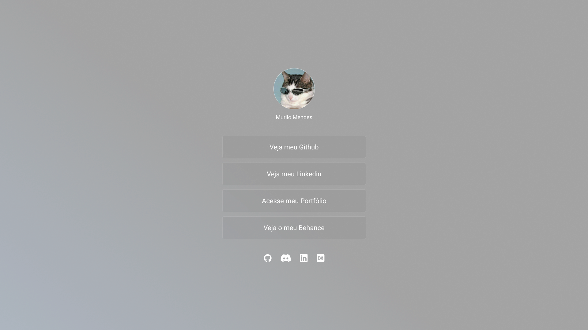

<br />

  <h1 align="center">Murilo Mendes - Dev Links 🧠 </h1>

<div align="center"></div>

<br>

> :mag_right: O Dev Link é uma aplicação básica que permite o usuário armazenar os links pessoais. Além disso, temos a página de 404 ( Not Found ), onde é possível o usuário voltar para a página apenas clicando em um botão.
> <br>

:paperclip: Link da aplicação: https://projeto-dev-links.vercel.app/

## :computer: Funcionalidades

- Exibit listagem dos links iteráveis
- Adicionar ou remover seu link específico
- Exibir o total de itens no carrinho no Header

## :rocket: Tecnologias

- [Vite](https://vitejs.dev/)
- [React](https://pt-br.reactjs.org/)
- [React Router Dom](https://reactrouter.com/pt/main)
- [Styled Components](https://styled-components.com/)

## :round_pushpin: Como Usar

<h3>Pré-requisitos</h3>

- [NodeJS](https://github.com/)
- [Git](https://github.com)
- [npm](https://www.npmjs.com/)

<h3>Clonar</h3>

```bash
git clone https://github.com/gtndeveloper/Dev_links.git
```

<h3>Iniciar</h3>

```bash
cd Dev_links
npm install
npm run dev
```


  </tr>
</table>
